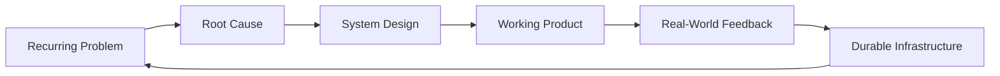

<h1>Nikolai Rangl</h1>

<h3>Systems builder focused on AI infrastructure, automation, and software that removes recurring failure.</h3>

I am building toward foundational systems for the next century: tools that make complex operations easier to understand, easier to run, and harder to break.

  <a href="https://nikolairangl.github.io/Prometheus-/">Prometheus Live Demo</a>
  |
  <a href="https://github.com/nikolairangl/Prometheus-">Prometheus Repository</a>
  |
  <a href="https://github.com/nikolairangl">GitHub Profile</a>

---

## The Thesis

The future will be limited less by ideas than by the systems required to execute them.

AI infrastructure, bitcoin mining operations, compute fleets, automation, monitoring, diagnostics, deployment pipelines, data visibility, and operational workflows are not background details. They are the foundation underneath progress.

When those systems are fragile, people waste time fighting the machine instead of expanding what is possible.

I want to build the systems that remove that friction.

## What I Am Building Toward

I am not interested in software as decoration. I am interested in software as leverage.

The long-term direction is clear:

| Layer | What I Want To Build |
| --- | --- |
| Infrastructure | Tools for operating compute, hardware, networks, and distributed systems at scale |
| Intelligence | Monitoring, diagnostics, analytics, and decision support for technical operations |
| Automation | Workflows that remove repetitive manual work and reduce operational drag |
| Interfaces | Clear software that helps humans understand and control complex systems |
| Cryptography | Practical applications for trust, verification, security, and decentralized systems |
| Foundations | Durable platforms that keep creating value after they are deployed |

## Operating Model

My process is simple:

- Start from first principles.
- Find the recurring failure.
- Build the system that removes it.
- Ship early.
- Learn from reality.
- Improve until the system becomes durable.

If a problem keeps happening, it should not keep happening forever.

## Background

I come from hands-on technical infrastructure environments: hardware diagnostics, deployments, bitcoin mining operations, fleet operations, technician support, workflow improvement, and large-scale systems under pressure.

That experience taught me that many failures are not caused by a single broken part. They come from fragmented information, weak processes, poor visibility, missing automation, and tools that were never designed for scale.

That is what pushed me toward software.

I build because software can turn operational pain into repeatable systems.

## Current Focus

| Domain | Direction |
| --- | --- |
| AI Infrastructure | Operations, reliability, tooling, and visibility for compute environments |
| Bitcoin Mining Operations | Fleet visibility, diagnostics, uptime, automation, and operational efficiency |
| Automation | Replacing repetitive workflows with systems that scale |
| Monitoring | Turning raw signals into useful operational intelligence |
| Data Systems | Dashboards, analytics, reporting, and decision support |
| Distributed Systems | Understanding how complex technical environments behave under load |
| Cryptographic Applications | Exploring systems built around verification, security, digital ownership, and trust |
| Human Operations | Building tools that technicians and engineers actually want to use |

## Public Work

My public repositories today are focused builds and demos. They are not the final destination. They are proof of direction: design, execution, iteration, and shipping.

The trajectory is production-grade systems for infrastructure, automation, monitoring, and AI operations.

### Prometheus

An interactive browser-based space simulation built with JavaScript and Three.js.

- Live demo: https://nikolairangl.github.io/Prometheus-/
- Repository: https://github.com/nikolairangl/Prometheus-
- Focus: real-time interaction, 3D rendering, browser deployment, simulation thinking

## Standards

I measure software by what it eliminates:

- Manual steps that should be automated
- Confusion that should be made visible
- Failures that should be predicted
- Processes that should be standardized
- Workflows that should become systems

Good software is not just code that runs.

Good software increases human capability.

## The Long Game

I think in systems, foundations, and long timelines.

The next century will need better infrastructure, better AI operations, better automation, stronger cryptographic systems, and better tools for people managing complex environments. I want to help build those systems.

I am at the beginning of that path, and I am building in public.

**Build useful systems. Make them real. Make them foundational.**
